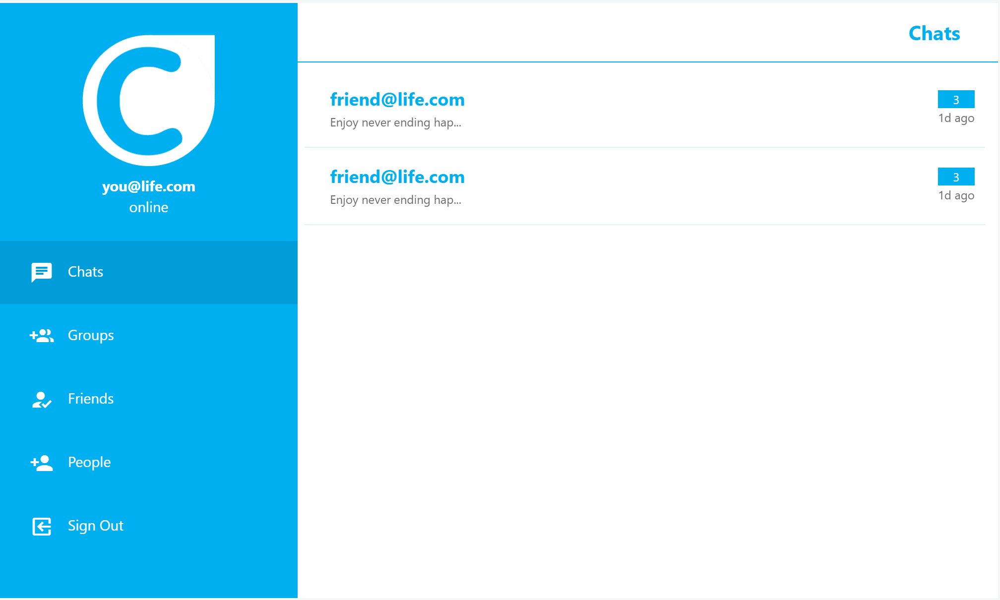
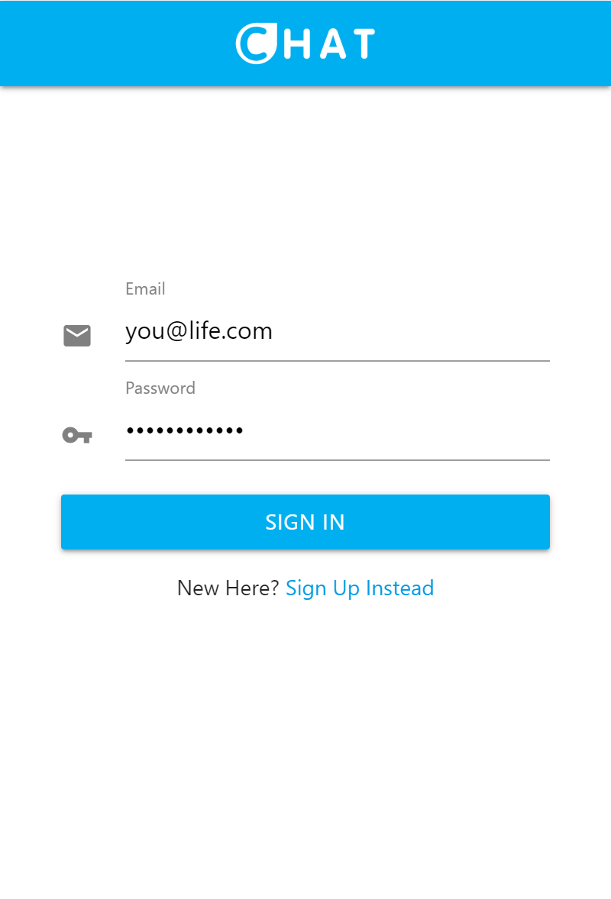
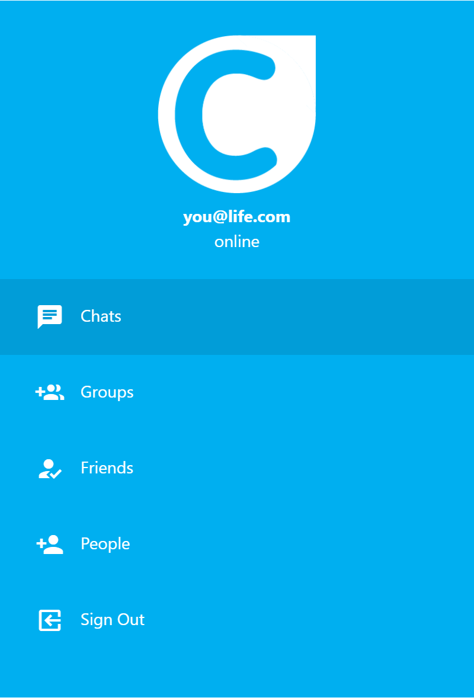
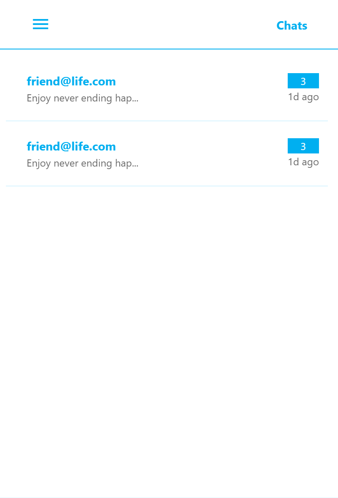
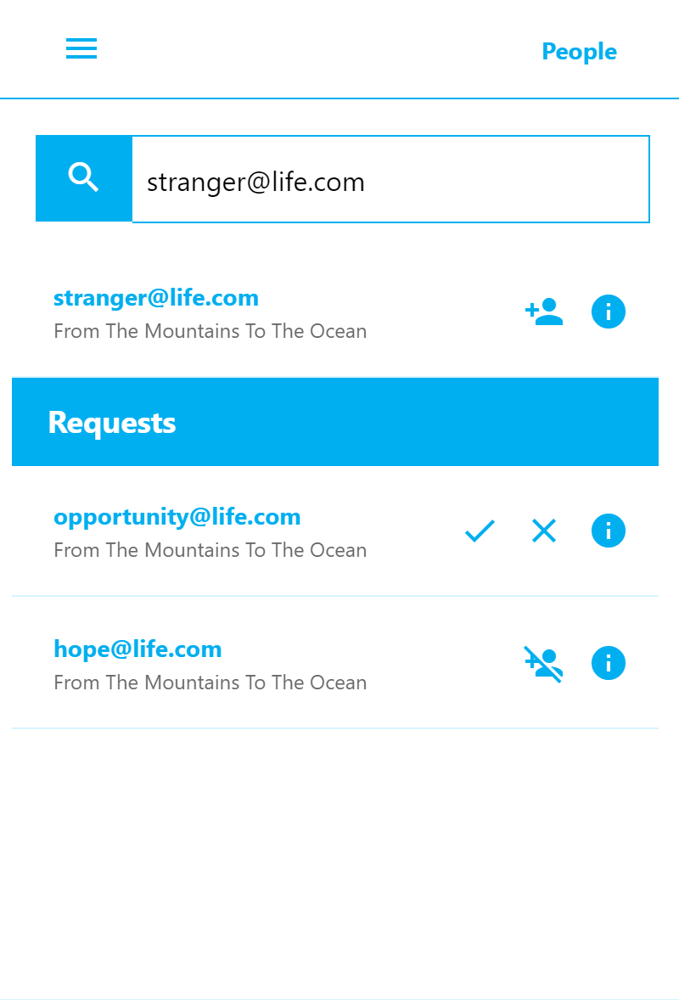

 

  

  <h3 align="center">Chat App User Interface</h3>

  

    A simple & responsive UI skeleton for a chat app, using html, css &amp; js.
     
	<strong>Feel free to use it to test your back-end development skills.</strong>
    
    
	   <a href="https://smmehrab.github.io/chatAppUI/"><strong>Give it a try »</strong></a>
    
    
 

## Glimpse

### Desktop

### Mobile

| | |
|------|-------|
|||
|||
|||

